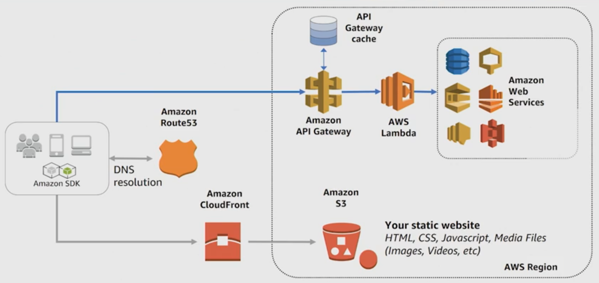

# AWS Lambda == heart of Serverless
- lets you run code without provisioning or managing Serverless
- triggers on your behalf in response to events
- scales automatically
- provides built in code monitoring and logging

AWS Serverless platform also include a number of fully managed services tighted intergrated with lambda:
- API Gateway
- Amazon S3, dynamoDB, etc..
- SNS and SQS
- AWS Step functions fo orchestration
- Kinesis and Athena for Analysis
- Developer tools (SAM)

# Typical example


# Lambda Features
- developping in lambda is easy, support for different languages
- integrates with and extends other AWS services
- flexible resource and concerrency model: instead of scaling by adding servers, Lambda scales in response to events. You configure memory settings and AWS handles CPU, Network, IO throughput.
- flexible permissions model, use Identity Access Management (IAM) to grant access to the desired resources and gives fine-grained control for invoking functions
- High Availability and fault tolerance
- don't pay for idle

# Permissions
- permission to *trigger* a function
- permission to *interact* with other services

those permissions are managed by AWS IAM through:
- IAM Resource Policy/Function Policy: permissions to invoke function
- IAM Execution Role: controls what the function is allowed to do

## Execution Role
What the function is permitted to do (ex: write to this DynamoDB table..)
The Execution Role is a IAM role that is *selected or created* when you create a Lambda function.
The *IAM policy* defines the actions that the role is allowed to take with the resource (ex: write into the DynamoDB table)
The role need also to include a *Trust Policy* that allows Lambda to *AssumeRole* so that it can take actions from other services.
Lambda provides managed roles with predefined permissions that helps simplify the process of creating an Execution Role => we do not have to create role and policy from scratch
Creatir must have permission for `iam:PassRole`

By default, resource within a VPC are not accessible from within a Lambda function. Lambda runs from its own VPC. To enable the Lambda to access our private PVC we need to provide additional VPC configuration like subnet and security group IDs. AWS uses this information to set an Elastic Network Interface that enable to connect securely to other resources within our private VPC. For this reason IAM execution role needs permission to: create, describe and delete network interfaces.

## Resource/Function Policy
A resource policy is used to tell the Lambda service which events have permission to invoke the  Lambda function. Resource policies also make it easy to grant access to the Lambda function across AWS accounts.
- policy associated with a "push" event source
- created when you add a trigger to a Lambda function
- Allows the event source to take the *lambda:InvokeFunction* action

## Types of Event Sources
An `Envet source` is the entity that publishes an event, the `Lambda function` is the custom code that process those events.
There's lot of different option to trigger a lambda function.
- Data stores: Amazon S3, etc...
- Endpoints: emit events that triggers lambda function ex: Alexa, Api gateway, etc..
- Repositories: Amazon CloudWatch, CloudCommit based on specific action on repositories
- Message services: SES or SNS

Push Events:
- synchronous / Asynchronous (Serivce delivers events directly to function
Polling Events:
- Stream-based, not stream-based: lambda polls from events and delivers to function

when invkoking a lambda function programmatically we have to specify the *invocation type*

## Sync vs Async
- the event source directly triggers the function. when a client makes a request to the API Gateway, expects a response immediatly, the invoking application receives an error if it can't invoke the function. Use the `RequestResponse` api
- the triggering event doesn't wait around for a response. We can enable Dead Letter Queue (DLQ) or discardered the request will be discarded after 3 attemps
  - AWS Lambda destination: route the resoulte of an async invocation to an AWS service without writing code. We have 4 destination options:
    - Lambda function
    - SQS queue
    - SNS topic
    - EventBridge event bus
    we can specify a destination fo `onSuccess` and one for `onFailure`.
  Use the `Event` api

## Polling Events
Events put information into the stream (DynamoDB/Kinesis) or the queue (Amazon SQS). The Lambda funciton polls the stream or queue for changes and if it finds records it will deliver the payload and invoking the function.
For stream-based polling, if there is an error processing the records lambda will retry until the data expires (up to 7 days). Any error blocks lambda from reading any new record from the stream until process successfully or expiration. This because the sequence is important in the stream.
For the queue-based polling, if an invocation fails or times out the failed message comes back in the queue. It will be available for invocation again once the visibility timeout perid expires. Lambda will keep retry the exectution untill success or expiration.

# Lifecycle of a lambda function

When a function is first invoked ana execution environment is launched and bootstraped, this include downloading the code and loading the execution runtime for the environment. For example, if the function is written in nodejs, the nodejs framework needs to be loaded in the container.
Then the function code is executed. Then Lambda freezes the execution environment because we expect that there will be additional invocation in the future. If another invocation is made while the function is in the state, then the request goes through a `warm start` => the code is immediatly executed without have the need of bootstrapping the container.
This behaviour continues as long as the requests comes consistently. If the execution environments is idle for too long (`idle timeout`), then the environment is recycled and another invocation request will require again to pass through the bootstrap phase (`cold start`).

Good practices to take advantage of the Warm Start:
- Store and reference external dependencies locally
- Limit re-initialization of variables or objects at every invocation
- Check if a connection already exist and reuse it
- Add checks whether the local cache still has the data stored previously (500 MB available in the environment)

NOTE: testing from the console there's a cold start every time.

## Provisioned concurrency
`Provisioned concurrency` is a feature that keeps functions initialized and hyper-ready to respond in double-digit milliseconds. This is ideal for implementing interactive services, such as web and mobile backends, latency-sensitive microservices, or synchronous APIs. When you enable Provisioned Concurrency for a function, the Lambda service will initialize the requested number of execution environments so they can be ready to respond to invocations.
For more: [doc](https://aws.amazon.com/blogs/aws/new-provisioned-concurrency-for-lambda-functions/)

# Lambda function Model
- we can use the language and IDE we are most familiar with.
- find the list of supported runtimes to cofigure the function

## Hanlder method
Entrypoint that the AWS Lambda calls when starting executing the function.
```java
  Handler(event, context) method
```
- `event` object provide information about the event that triggers the Lambda function, this can be:
  - pre-defined object format for AWS integrations and events
  - or a user-defined custom objects
- `context` object, is generated by AWS and provides metadata about the execution:
  - includes data like:
    -- identifyawsRequestId: AWS `RequestId`
    -- logStreamName
    -- getRemainingTimeInMillis()

## Best Practices to design lambda
You want to separate the Lambda configuration part from the business logic, this allows to target unit test without worring of the configurion of the function.
Is also a best practice to make the function `modular`.
Instead of having a single function that perform an entire process (ex: CompressFile, CreateThumbnail, IndexFile), consider having different functions that serves the same purpose.
Because the function exist only when there's work to be done, is really important for serverless applications to threat the function as `stateless`.

- We can cache in a /tmp cache some values, that will be available for a warm start, but that will be lost with a cold start.
- If we need to maintain a state, persist values to a DynamoDB and call from there at each invocation. DynamoDB has very low latency, so great for stateless applications.
- If we have to put the lambda function in a VPC, probably consider using `ElastiCache` that maybe is less expensive than DynamoDB
- Note: use a file on Amazon S3 only if the throughput isn't critical.
- minimizing deployement packaging dependencies and its overall size. This can have a significant impact of the lambda function to reduce the bootstrap time.
- handle exceptions on the code and log them appropiately
- avoid a situation where a function calls itself or if accidentally deploy recursive code, set the concurrent execution limit to 0 to immediately throttle invocations while you fix the code.
- TAKE ADVANTAGE FROM A WARM START

# Authoring Lambda functions
- Write the code from the `Lambda console` using the AWS Cloud9 IDE (browser-based). When you save the lambda function, the lambda service gets deployed to the AWS cloud.
- Use `Lambda management Console` you can create a deployement package with our IDE and then deploy the package to Lambda using the console `upload package` option. In this scenario we can have a local testing and debugging tools (the `SAM CLI`) thorugh which we can simulate the environment locally and perform some tests. Best for small standalon applications less than 10MB package in size.
- Upload the deployment package in a S3 bucket and then specify the s3 URL from the object in the Lambda console. Best for packages greater than 10MB or part of CI/CD managed application.

# Lambda configuration
Deciding how to configure `Memory, Timeout and Concurrency` is about testing your functions in a real world scenario and against peak volumes and then monitoring to *optimize costs and ensure the derired customer expirience* with the application.
- Memory and Timeout are interdependent when trying to optimize for cost and speed at the function level:
  - you specify the amount of desired memory to allocate, then Lambda allocate the amount of CPU power in proportion to the memory.
  - larger memory == more CPU, higher cost per 100ms of duration, faster consumption of free tier seconds
  - smaller memory == less CPU, lower cost per 100ms of duration, slower consumption of free tier seconds
  - lower timoeut prevents long running requests: if we increase the memory, the cpu increase, but also the cost is higher
  - higher timeout allows for longer execution time: if we do not increase memory the execution time will be higher
  - note that the higher memory level might actually cost less because the function can complete quickly rather than a lower memory configurtion => this is why is important testing in with a real world scenario
  - max timeout limit = 15 minutes
  - it is possible to use a tool for tuning our configuration based on cost, speed or even balaned. [Repository](https://github.com/alexcasalboni/aws-lambda-power-tuning)
- Concurrency: capacity to serve certain number of requests at any specific time. The default account level limit is 1000 concurrent executions.
  - we can also specify a specific `Concurrency Reserve or Limit` at the function level.
  - unreserved concurrency == account limit (1000 by default) - reserved concurrency (reserve, at function level), function that dont have a specific associeted concurrency limit will use the unreserved concurrency limit
  - AWS Lambda will keep the Unreserved pool at a minimum of 100 to ensure that functions without reserve can be invoked.
  - why limit the function concurrency?
    - to *limit* function's concurrency:
      - handle costs
      - regulate how long it takes to process a batch of events
      - match up with function invocation speed with downstream processes that can't scale up as quickly as ambda can
    - to *reserve* function concurrency:
      - ensure tha you can handle peaks expected volumes of a critical function
      - because you see invocation errors in the logs and you want to redure the number of requests that get throttle.
